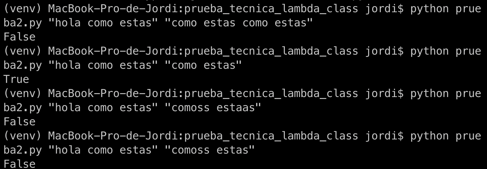

# Prueba técnica Desarrollador Backend de LambdaClass

## Prueba 1

### Enunciado

Dada una frase devuelve las palabras al revés.

```
input: ”hola como estas”
output: “aloh omoc satse”
```

### Solución

```python
import sys


def reverse():
    phrase = sys.argv[1]
    print(' '.join(word[::-1] for word in list(phrase.split())))


def reverse_more_efficient():
    phrase = sys.argv[1]
    result = ""
    phrase.split()
    for w in list(phrase.split()):
        result += reverse_recursive(str(w)) + " "
    print(result)


def reverse_more_efficient_2():
    phrase = sys.argv[1]
    result = ""
    phrase.split()
    result = reverse_list_recursive(phrase.split(), "")
    print(result)


def reverse_list_recursive(phrase, result):
    if len(phrase) == 0:
        return result
    result += reverse_recursive(phrase.pop(0)) + " "
    return reverse_list_recursive(phrase, result)


def reverse_recursive(word):
    if len(word) == 0:
        return ""
    return word[len(word) - 1] + reverse_recursive(word[0: len(word) - 1])


if __name__ == '__main__':
    reverse_more_efficient()
```

### Ejecución

```bash
python prueba.py "hola como estas"
```

## Prueba 2 - Ransom Note

### Enunciado

Ransom Note

A kidnapper plans to write a ransom note by cutting out words
from a newspaper.
Write a function that given a note and
a newspaper returns true or false if it is possible to
write the note with the given newspaper.
(Keep in mind that the words are cut out in full,
they are not assembled letter by letter).

### Solución

```python
import sys


def can_write_note_by_newspaper():
    newspaper = sys.argv[1]
    note = sys.argv[2]
    can_write = [(word in list(newspaper.split())) for word in note.split()]
    print(all(can_write))


def can_write_note_by_newspaper_optimized():
    newspaper = sys.argv[1]
    note = sys.argv[2]
    print(can_write_list_recursive(list(newspaper.split()), list(note.split())))


def can_write_list_recursive(newspaper, note):
    if len(note) == 0:
        return True
    new_newspaper = newspaper.copy()
    note_word = note.pop(0)
    current_word_result = is_this_word_in_newspaper(new_newspaper, note_word)
    if current_word_result is False:
        return False
    newspaper.remove(note_word)
    return can_write_list_recursive(newspaper, note)


def is_this_word_in_newspaper(newspaper, note_word):
    if len(newspaper) == 0:
        return False
    if newspaper.pop(0) == note_word:
        return True
    return is_this_word_in_newspaper(newspaper,note_word)


if __name__ == '__main__':
    can_write_note_by_newspaper_optimized()
```

### Ejecución

```bash
python prueba2.py "hola como estas" "hola estas"
```

### Output


